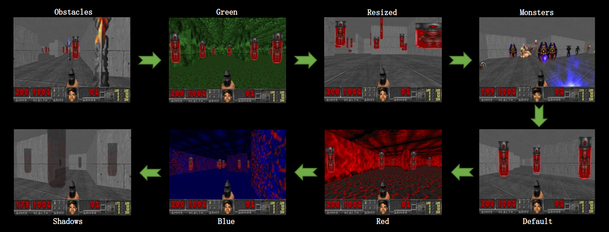
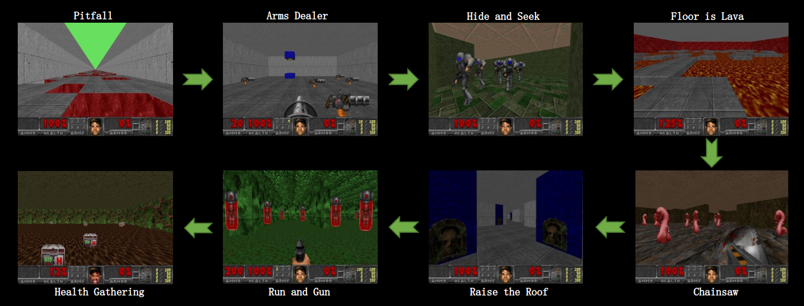
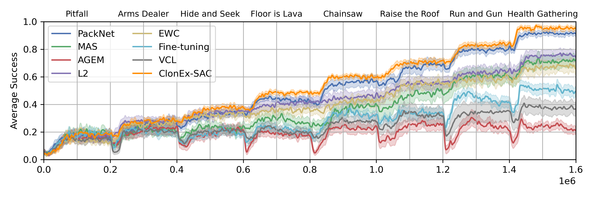
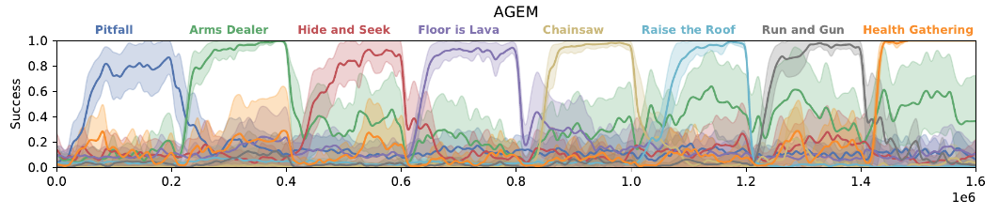
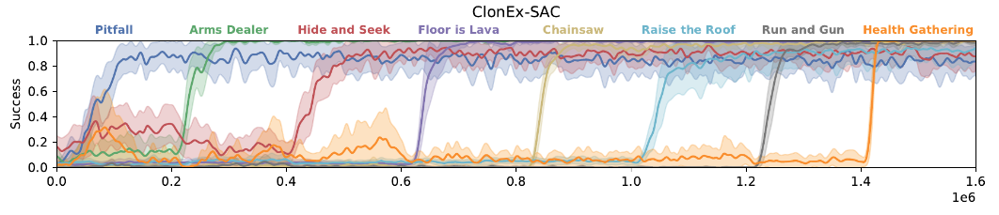
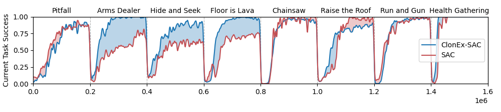

# COOM

COOM is a Continual Learning benchmark for embodied pixel-based RL, consisting of task sequences in visually 
distinct 3D environments with diverse objectives and egocentric perception. COOM is designed for task-incremental learning,
in which task boundaries are clearly defined. A short presentation of COOM can be found on 
[SlidesLive](https://recorder-v3.slideslive.com/#/share?share=85989&s=533e46f9-1a4c-47ce-a82f-2a427bdd6429)
and a demo is available below    
[](https://www.youtube.com/watch?v=FUm2B8MZ6d0&list=PL6nJZHA3y2fxQK73jmuI5teM3n6Mydcf7).

## Installation
1. Clone the repository
```bash
$ git clone https://github.com/hyintell/COOM
```
2. Navigate into the repository
```bash
$ cd COOM
```
3. Install COOM from source with pip
```bash 
$ pip install .
```

## Environments
The benchmark consists of 8 scenarios:

| Scenario         | Success Metric    | Enemies | Weapon  | Items   | Max Steps | Execute | Stochasticity                              | 
|------------------|-------------------|---------|---------|---------|-----------|---------|--------------------------------------------|    
| Pitfall          | Distance Covered  | &cross; | &cross; | &cross; | 1000      | JUMP    | Pitfall tile locations                     | 
| Arms Dealer      | Weapons Delivered | &cross; | &check; | &check; | 1000      | SPEED   | Weapon spawn locations, delivery locations | 
| Hide and Seek    | Frames Alive      | &check; | &cross; | &check; | 2500      | SPEED   | Enemy behaviour, item spawn locations      | 
| Floor is Lava    | Frames Alive      | &cross; | &cross; | &cross; | 2500      | SPEED   | Platform locations                         | 
| Chainsaw         | Kill Count        | &check; | &check; | &cross; | 2500      | ATTACK  | Enemy and agent spawn locations            | 
| Raise the Roof   | Frames Alive      | &cross; | &cross; | &cross; | 2500      | USE     | Agent spawn location                       | 
| Run and Gun      | Kill Count        | &check; | &check; | &cross; | 2500      | ATTACK  | Enemy and agent spawn locations            | 
| Health Gathering | Frames Alive      | &cross; | &cross; | &check; | 2500      | SPEED   | Health kit spawn locations                 | 


## Task Sequences for Continual Learning
There are three lengths of Continual Learning task sequences in our benchmark: 
1) 8-task sequences act as the core of the benchmark
2) 4-task sequences are comprised of the 2<sup>nd</sup> half of the main sequence
3) 16-task sequences concatenate two core sequences

We further distinguish between two sequence types: `Cross-Domain` and `Cross-Objective`. 

### Cross-Domain
In the cross-domain setting, the agent is sequentially trained on modified versions of the same ViZDoom scenario. 
`Run and Gun` is selected as basis for this CL sequence, since out of the 8 scenarios in the benchmark, it best resembles 
the actual Doom game, requiring the agent to navigate the map and eliminate enemies by firing a weapon. The objective and
the layout of the map remain the same across tasks, whereas we modify the environment in the following ways: 
1) Changing the textures of the surrounding walls, ceiling and floor 
2) Varying the size, shape and type of enemies 
3) Randomizing the view height of the agent, and 
4) Adding objects to the environment which act as obstacles, blocking the agent’s movement.

#### Tasks in the Cross-Domain 8 (CD8) sequence

### Cross-Objective
Cross-objective task sequences employ a different scenario with a novel objective for each consecutive task, apart from 
only changing the visuals and dynamics of a single scenario. This presents a diverse challenge, as the goal might 
drastically change from locating and eliminating enemies (`Run and Gun` and `Chainsaw`) to running away and hiding 
from them (`Hide and Seek`). In a similar fashion, the scenario `Floor is Lava` often requires the agent to remain at a 
bounded location for optimal performance, whereas scenarios `Pitfall`, `Arms Dealer`, `Raise the Roof`, and `Health 
Gathering` endorse constant movement.
#### Tasks in the Cross-Objective 8 (CO8) sequence


# Getting Started
Below we provide a short code snippet to run a sequence with the COOM benchmark.

## Basic Usage
```
from COOM.env.continual import ContinualLearningEnv
from COOM.utils.config import Sequence

cl_env = ContinualLearningEnv(Sequence.CO8)
for env in cl_env.tasks:
    env.reset()
    done = False
    while not done:
        action = env.action_space.sample()
        state, reward, done, truncated, info = env.step(action)
        env.render()
        if done:
            break
    env.close()
```

# Baseline Results
We have employed various popular continual learning algorithms to evaluate their performance on the COOM benchmark.
The algorithms are implemented on top of the Soft-Actor-Critic (SAC) reinforcement learning algorithm.
Please follow the instructions in the [CL module](CL/README.md) to use the algorithms.
The following table ranks the baselines from best to worst performing

| Method                                                                                                               | Type           |                                                                                                        
|----------------------------------------------------------------------------------------------------------------------|----------------|
| [PackNet](https://openaccess.thecvf.com/content_cvpr_2018/papers/Mallya_PackNet_Adding_Multiple_CVPR_2018_paper.pdf) | Structure      |
| [ClonEx-SAC](https://arxiv.org/pdf/2209.13900.pdf)                                                                   | Memory         |
| L2                                                                                                                   | Regularization |
| [MAS](https://arxiv.org/pdf/1711.09601.pdf)                                                                          | Regularization |
| [EWC](https://www.pnas.org/doi/epdf/10.1073/pnas.1611835114)                                                         | Regularization |
| Fine-Tuning                                                                                                          | Naïve          |
| [VCL](https://arxiv.org/pdf/1710.10628.pdf)                                                                          | Regularization |                                                           
| [AGEM](https://arxiv.org/pdf/1812.00420.pdf)                                                                         | Memory         |
| [Perfect Memory*](https://arxiv.org/abs/2105.10919)                                                                  | Memory         |

_*The memory consumption of the method is too high to run on longer sequences of the benchmark, so it does not follow the ranking in the table._ 

## Evaluation Metrics
We evaluate the continual learning methods on the COOM benchmark based on Average Performance, Forgetting, and Forward Transfer.
### Average Performance
The performance (success rate) averaged over tasks is a typical metric for the continual learning setting. The agent is continually
evaluated on all tasks in the sequence even before encountering it. By the end of the sequence, the agent should have mastered all tasks.



### Forgetting
Forgetting occurs when the agent's performance on a task decreases after training on a subsequent task.
This is a common problem in continual learning, as the agent has to learn new tasks while retaining the knowledge of the previous ones.
We measure forgetting by comparing the performance of the agent on a task after training and at the end of the entire sequence.
The image below depicts heavy forgetting in the example of AGEM. 


Contrary to AGEM, ClonEx-SAC is able to retain the knowledge of the previous tasks.


### Forward Transfer
Transferring learned knowledge from one task to another is a key aspect of continual learning. We measure the forward 
transfer of the continual learning methods by how efficiently they train on each given task compared to the 
Soft Actor-Critic (SAC) baseline, which is trained directly on the same from scratch. The red areas between the curves 
represent negative forward transfer and other colors represent positive forward transfer as depicted on the image below.



## Reproducing results
For reproducing the results in our paper please follow the instructions in the [results module](results/README.md).

# Acknowledgements

COOM is based on the [ViZDoom](https://github.com/mwydmuch/ViZDoom) platform.  
The `Cross-Domain` task sequences and the `run_and_gun` scenario environment modification were inspired by the [LevDoom](https://github.com/TTomilin/LevDoom) generalization benchmark.  
The base implementations of SAC and continual learning methods originate from [Continual World](https://github.com/awarelab/continual_world).  
Our experiments were managed using [WandB](https://wandb.ai).

# Citation
If you use our work in your research, please cite it as follows:
```
@inproceedings{tomilin2023coom,
    title={COOM: A Game Benchmark for Continual Reinforcement Learning},
    author={Tomilin, Tristan and Fang, Meng and Zhang, Yudi and Pechenizkiy, Mykola},
    booktitle={Thirty-seventh Conference on Neural Information Processing Systems Datasets and Benchmarks Track},
    year={2023}
}
```